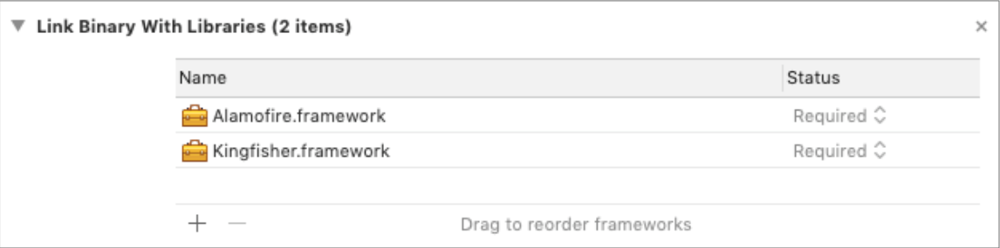
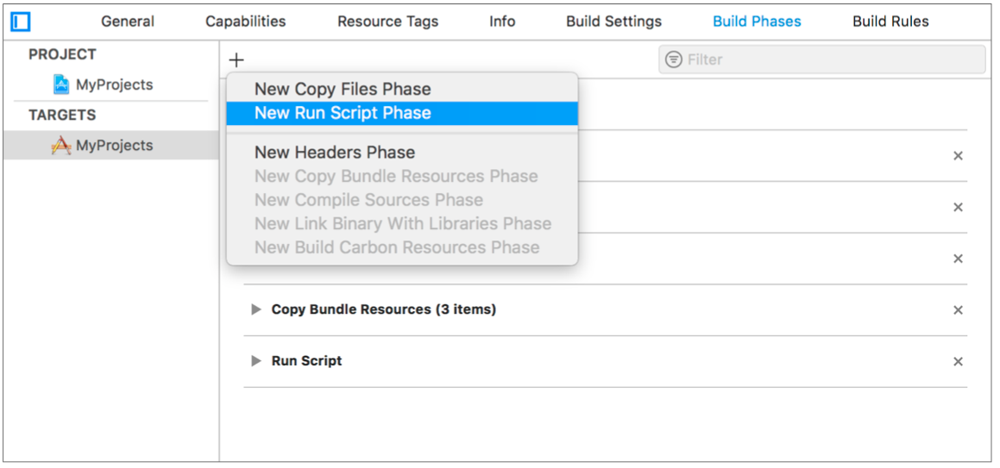
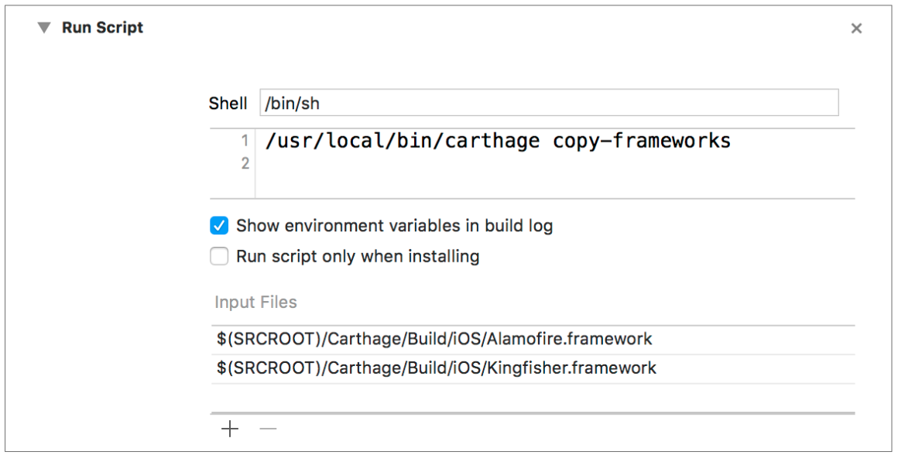

## Carthage

- **Install Carthage**

  ```
  // 미설치시 설치
  $ brew update && brew install carthage
  // brew 가 없을 경우 https://brew.sh 에서 설치
  
  // 이미 설치되어 있을 때 업그레이드
  $ brew upgrade carthage 
  ```

  

- **Edit Cartfile**

  사용할 프로젝트의 [ProjectName].xcodeproj가 있는 폴더에 Cartfile을 만든다.

  ```
  $ vi Cartfile
  ```

  

  내부에 작성할 내용
  아래 형식으로 적어주면 된다.

  ```
  github “[GITHUB ACCOUNT]/[REPO NAME]”
  ```

  

  예시

  ```
  # 사용할 라이브러리 작성
  github "Alamofire/Alamofire"
  github "onevcat/Kingfisher"
  ```

  

- **Install Library**

  ```
  $ carthage update  
  // 전체 업데이트
   
  $ carthage update --platform iOS 
  // iOS Platform 한정
  
  $ carthage update [LibraryName]
  // 여러 가지 라이브러리 중 일부만 지정하여 업데이트 할 때
  ```

  

- **Link Binary With Libraries**

  

- **New Run Script Phase**

  

- **Run Script**

  

- **Setting**

  ```
  Build Phases - Run Script - Shell
  > /usr/local/bin/carthage copy-frameworks
  
  Build Phases - Run Script - Input Files
  > $(SRCROOT)/Carthage/Build/iOS/[Library Name].framework
  ```

  