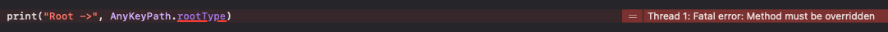

# KVC

> Key-Value-Coding

- 객체의 값을 **직접** 가져오지않고, Key 또는 `KeyPath`를 이용하여 **간접적으로** 데이터를 가져오거나 수정하는 방법
- Swift에서는 `KeyPath`를 사용함
  - 어떤 **프로퍼티의 위치** 참조
  - 루트 위치부터 경로로 찾아감 `\Root.path.path`
  - 간접적으로 특정 타입의 어떤 값을 가리켜야 할지 미리 지정해두고 사용

### 목차

- [AnyKeyPath](#anykeypath)
- [PartialKeyPath\<Root\>](#partialkeypathroot)
- [KeyPath\<Root, Value\>](#keypathroot-value)
- [WritableKeyPath\<Root, Value\>](#writablekeypathroot-value)
- [ReferenceWritableKeyPath\<Root, Valeu\>](#referencewritablekeypathroot-valeu)
- [_AppendKeyPath](#_appendkeypath)


## AnyKeyPath

> 모든 루트 유형에서 결과 값 유형까지 유형이 지워진 키 경로

참조: https://developer.apple.com/documentation/swift/anykeypath

- 키 경로 타입의 최상위 클래스

- Equatable, Hashable 프로토콜을 채택하고있어서 비교, `Dictionaty`의 `Key`값으로 사용이 가능함

- 타입 프로퍼티로 `rootType: Any.Type`, `valueType: Any.Type`이 있으나 접근하려 하면 메서드를 반드시 override 해야한다며 `Fatal Error` 발생

  

  - 유형이 지워진 키 경로라는 말이 이뜻인듯?

- `_AppendKeyPath` 프로토콜을 채택하여 `appending(path: AnyKeyPath) -> AnyKeyPath?` 함수를 사용하여 `KeyPath` 추가 가능

  - 내부적으로 프로토콜 확장을 통해 타입별로 `KeyPath` 추가 함수를 구현하고 있음

- 사용

  - 키 경로는 역슬래시(\\)와 타입, 마침표(.) 경로로 구성됨

    `\타입이름.경로.경로.경로`

    ``` swift
    // String타입의 count 프로퍼티 경로
    let anyKeyPath: AnyKeyPath = \String.count
    
    let str = "Yang Jungchang"
    
    // AnyKeyPath를 사용하여 접근하게되면 Any? 타입으로 나옴
    let count = str[keyPath: anyKeyPath] 
    print("count: \(count)")
    
    /*
    출력 결과
    count: Optional(14)
    */
    ```
  
    

## PartialKeyPath\<Root\>

> 구체적 루트 유형에서 결과값 유형까지 부분적으로 유형이 지워진 키 경로

참조: https://developer.apple.com/documentation/swift/partialkeypath

- `AnyKeyPath` 클래스 상속

- Root 타입은 명시를 하고 Value 타입은 명시하지 않기에 Root 빼고 지워져 있다는듯...

- Root 타입을 명시 하기에 타입 프로퍼티 `rootType: Any.Type`에 접근하면 값이 나올줄 알았는데  `AnyKeyPath`와 같이 `Fatal Error` 발생 (왜일까...)

- 사용

  ```swift
  // Root 타입이 명시되어있어 String 하위 경로만 사용 가능
  let anyKeyPath: PartialKeyPath<String> = \String.count 
  
  let str = "Yang Jungchang"
  
  // AnyKeyPath와는 달리 Root 타입 정보가 명시되어있어서 해당하는 하위 경로가 있다는걸 보장 하기에 Any 타입이 나옴
  let count = str[keyPath: anyKeyPath] 
  print("count: \(count)")
  
  /*
  출력 결과
  count: 14
  */
  ```


## KeyPath\<Root, Value\>

> 특정 루트 유형에서 특정 결과 값 유형까지의 키 경로

참조: https://developer.apple.com/documentation/swift/keypath

- `PartialKeyPath` 클래스 상속

- **Read-only** 

- Root 타입과 Value 타입을 명시 하며 타입 프로퍼티 `rootType: Any.Type`과 `valueType: Any.Type`에 접근해 타입 값을 가져올 수 있음(하위 클래스는 당연 가능)

  ``` swift
  print("Root: \(KeyPath<String, Int>.rootType)")
  print("Value: \(KeyPath<String, Int>.valueType)")
  
  /*
  출력 결과
  Root: String
  Value: Int
  */
  ```

- 사용

  ```swift
  struct Person {
      let name: String
      let address: Address
  }
  
  struct Address {
      let town: String
  }
  
  // Root와 Value 타입이 명시되어있어 Person의 하위 프로퍼티이면서 String 타입의 프로퍼티만 할당 가능
  let nameKeyPath: KeyPath<Person, String> = \Person.name
  
  let yjc = Person(name: "Yang Jungchang", address: Address(town: "서울"))
  
  let name = yjc[keyPath: nameKeyPath]
  print("name: \(name)") // name: Yang Jungchang
  
  // 경로를 따라 Person -> address -> town 프로퍼티까지 접근
  // 해당 프로퍼티가 상수라서 KeyPath<Person, String>으로 타입 추론됨
  let townKeyPath = \Person.address.town
  
  let town = yjc[keyPath: townKeyPath]
  print("town: \(town)") // town: 서울
  
  ```


## WritableKeyPath\<Root, Value\>

> 결과 값에서 읽고 쓰기를 지원하는 키 경로

참조: https://developer.apple.com/documentation/swift/writablekeypath

- `KeyPath` 클래스 상속

- 읽기, 쓰기 가능

- 해당 프로퍼티나 객체가 변수이어야만 사용 가능 아니면 에러!!

- 사용

  ```swift
  struct Person {
      let name: String
      var address: Address
  }
  
  struct Address {
      var town: String
  }
  
  // struct이기에 var 선언해야 WritableKeyPath 사용 가능
  var yjc = Person(name: "양중창", address: Address(town: "서울"))
  
  // Person.address는 변수, Address.town 또한 변수이기에 WritableKeyPath 타입
  let townKeyPath: WritableKeyPath<Person, String> = \Person.address.town
  
  // town KeyPath로 접근해 값을 읽음
  let twon = yjc[keyPath: townKeyPath]
  print("twon: \(town)")
  
  // town KeyPath로 접근해 값을 변경함
  yjc[keyPath: townKeyPath] = "경기도"
  print("town: \(yjc.address.town)") // town: 경기도
  
  // Person.name 프로퍼티는 let으로 선언되어있어 WritableKeyPath가 아닌 KeyPath 타입으로 추론됨
  let nameKeyPath = \Person.name
  yjc[keyPath: nameKeyPath] = "양창중" // KeyPath 타입은 read-olny이기에 값을 변경하려 하면 컴파일 에러
  ```


## ReferenceWritableKeyPath\<Root, Valeu\>

> 참조 의미 체계를 사용하여 결과 값에서 읽고 쓰는 것을 지원하는 키 경로

참조: https://developer.apple.com/documentation/swift/referencewritablekeypath

- `WritableKeyPath` 클래스 상속

- `WritableKeyPath`와 마찬가지로 읽기, 쓰기 가능

- [`KeyPath`, `WritableKeyPath`]이냐 `ReferenceWritableKeyPath`의 차이는 해당 프로퍼티가 속한 타입에 있음, 참조 타입과 값타입의 개념과 같음

  - 만약 해당 프로퍼티가 `참조 타입`의 프로퍼티라면 `ReferenceWritableKeyPath`가 될 것이고, `값 타입`의 프로퍼티라면 `KeyPath` 또는 `WritableKeyPath`가 될 것임

- 해당 프로퍼티가 `참조 타입`에 속하더라도 **상수**라면 해당 프로퍼티의 키경로는 `KeyPath`가 된다.

  ``` swift
  struct Person {
      let name: String
      var age: Int
      let address: Address
  }
  
  class Address {
      let country: String
      var town: String
      
      init(country: String, town: String) {
          self.country = country
          self.town = town
      }
  }
  
  let yjc = Person(name: "양중창", age: 31, address: Address(country: "대한민국", town: "서울"))
  
  let nameKeyPath = \Person.name // KeyPath<Person, String>
  let ageKeyPath = \Person.age // WritableKeyPath<Person, Int>
  let addressKeyPath = \Person.address // KeyPath<Person, Address>
  let countryKeyPath = \Person.address.country // KeyPath<Person, String>
  let townKeyPath = \Person.address.town // ReferenceWritableKeyPath<Person, String>
  
  print("name: \(yjc[keyPath: nameKeyPath])") // name: 양중창
  print("age: \(yjc[keyPath: ageKeyPath])") // age: 31
  print("address: \(yjc[keyPath: addressKeyPath])") // address: Playground.Address
  print("country: \(yjc[keyPath: countryKeyPath])") // country: 대한민국
  print("town: \(yjc[keyPath: townKeyPath])") // town: 서울
  ```

- 사용

  ``` swift
  struct Person {
      let name: String
      var age: Int
      let address: Address
  }
  
  class Address {
      let country: String
      var town: String
      
      init(country: String, town: String) {
          self.country = country
          self.town = town
      }
  }
  
  let yjc = Person(name: "양중창", age: 31, address: Address(country: "대한민국", town: "서울"))
  
  // Person.address가 let이더라도 참조타입이기에 내부 Address.town 프로퍼티 값 변경이 가능함
  let townKeyPath: ReferenceWritableKeyPath<Person, String> = \Person.address.town
  
  yjc[keyPath: townKeyPath] = "경기도"
  print("town: \(yjc.address.town)") // town: 서울
  ```


## _AppendKeyPath

> 키 경로 타입의 경로 추가 프로토콜

- `AnyKeyPath`에서 채택하는 프로토콜, 따라서 하위 타입들은 모두 채택되어 있음

- 이 프로토콜을 직접 사용하지 말라고 되어있음

- 키 경로 타입의 경로를 추가하는 함수가 모여있음

- `appending(path:)` 함수가 타입별로 확장 구현되어 있음

  ``` swift
  @inlinable public func appending<Root>(path: AnyKeyPath) -> PartialKeyPath<Root>? where Self == PartialKeyPath<Root>
  
  @inlinable public func appending<Root, AppendedRoot, AppendedValue>(path: KeyPath<AppendedRoot, AppendedValue>) -> KeyPath<Root, AppendedValue>? where Self == PartialKeyPath<Root>
  
  @inlinable public func appending<Root, AppendedRoot, AppendedValue>(path: ReferenceWritableKeyPath<AppendedRoot, AppendedValue>) -> ReferenceWritableKeyPath<Root, AppendedValue>? where Self == PartialKeyPath<Root>
  
  @inlinable public func appending<Root, Value, AppendedValue>(path: KeyPath<Value, AppendedValue>) -> KeyPath<Root, AppendedValue> where Self : KeyPath<Root, Value>
  
  @inlinable public func appending<Root, Value, AppendedValue>(path: ReferenceWritableKeyPath<Value, AppendedValue>) -> ReferenceWritableKeyPath<Root, AppendedValue> where Self == KeyPath<Root, Value>
  
  @inlinable public func appending<Root, Value, AppendedValue>(path: WritableKeyPath<Value, AppendedValue>) -> WritableKeyPath<Root, AppendedValue> where Self == WritableKeyPath<Root, Value>
  
  @inlinable public func appending<Root, Value, AppendedValue>(path: ReferenceWritableKeyPath<Value, AppendedValue>) -> ReferenceWritableKeyPath<Root, AppendedValue> where Self == WritableKeyPath<Root, Value>
  
  @inlinable public func appending<Root, Value, AppendedValue>(path: WritableKeyPath<Value, AppendedValue>) -> ReferenceWritableKeyPath<Root, AppendedValue> where Self == ReferenceWritableKeyPath<Root, Value>
  
  // extension where Self == AnyKeyPath
  @inlinable public func appending(path: AnyKeyPath) -> AnyKeyPath?
  ```

- 사용

  ``` swift
  struct Person {
      let name: String
      var age: Int
      let address: Address
  }
  
  struct Address {
      let country: String
      let town: String
  }
  
  let yjc = Person(name: "양중창", age: 31, address: Address(country: "대한민국", town: "서울"))
  
  // 시작점이 될 키 경로
  let addressKeyPath = \Person.address
  
  // Person.address에 Address.town 경로 추가
  // Person.address는 Address 타입이기에 Address.town 경로 추가가 가능함
  // 즉 KeyPath<Person, Address> 타입에서 Address 타입을 Root로 가지는 다음 경로를 추가할 수 있음
  let townKeyPath = addressKeyPath.appending(path: \Address.town)
  print("town: \(yjc[keyPath: townKeyPath])") // town: 서울
  
  // townKeyPath는 KeyPath<Person, String> 타입
  // 이미 Value 타입이 String이라는 것을 알기에 매개변수에 들어갈 Root 타입을 생략할 수 있음
  // 이 함수는 appending<Person, String, Int>(path: KeyPath<String, Int>) -> KeyPath<Person, Int>가 됨
  let townCountKeyPath = townKeyPath.appending(path: \.count)
  print("town.count: \(yjc[keyPath: townCountKeyPath])") // town.count: 2
  ```

  
