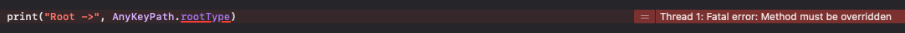

# KeyPath

> 키 경로

- 어떤 **프로퍼티의 위치** 참조
- 간접적으로 특정 타입의 어떤 값을 가리켜야 할지 미리 지정해두고 사용

## AnyKeyPath\<Root\>

> 키 경로 타입의 최상위 클래스

- [reference](https://developer.apple.com/documentation/swift/anykeypath)

- 모든 루트 유형에서 결과 값 유형까지 유형이 지워진 키 경로

- Equatable, Hashable 프로토콜을 채택하고있어서 비교, `Dictionaty`의 `Key`값으로 사용이 가능함

- 타입 프로퍼티로 `rootType: Any.Type`, `valueType: Any.Type`이 있으나 사용하려 하면 메서드를 반드시 override 해야한다며 `Fatal Error` 발생

  

  - 유형이 지워진 키 경로라는 말이 이뜻인듯?

- `_AppendKeyPath` 프로토콜을 채택하여 `appending(path: AnyKeyPath) -> AnyKeyPath?`함수를 사용하여 `KeyPath` 추가 가능

  - 프로토콜 확장을 통해 타입별로 `KeyPath` 추가 함수를 구현하고 있다.
