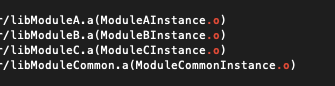

# Mach-O

> Mach Object file format

## Static Library

- 확장자: `.a`
- **excutable file**에 포함된다.

## Dynamic Library

- 확장자: ``.dylib``
- Dynamic library에 대한 참조만 **excutable file**에 포함된다.

## 모듈 구성 예시

타겟별 이미지


### Case 1.

 

``` sh
$ nm Mach_O_Sample_App.app/Mach_O_Sample_App| grep "\.o"
```

 

- 빌드된 앱 **excutable file**에 목적코드 심볼이 포함되어있다.

