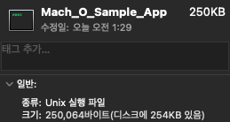

# Mach-O

> Mach Object file format

## Static Library

- 파일 형식:  `.a`
- **excutable file**에 포함된다.

## Dynamic Library

- 파일 형식: ``.dylib``
- Dynamic library에 대한 참조만 **excutable file**에 포함된다.

## 모듈 구성 예시

타겟별 이미지


### Case 1.


  빌드된 앱 **excutable file**의 심볼 정보를 출력

``` sh
$ nm Mach_O_Sample_App.app/Mach_O_Sample_App| grep "\.o"
```

| 이미지                                           | 설명                                                         |
| ------------------------------------------------ | :----------------------------------------------------------- |
|              | 빌드된 앱 **excutable file**에 **object file** 심볼이 포함되어있다. |
|  | 최종 앱 **excutable file**의 용량은 250KB 정도               |


