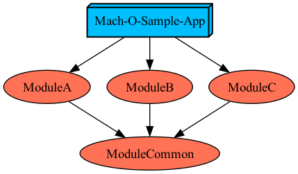
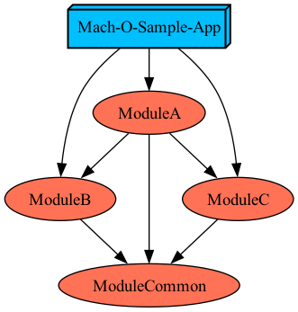
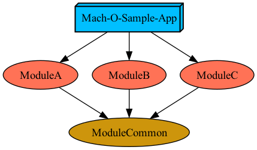
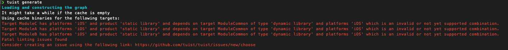
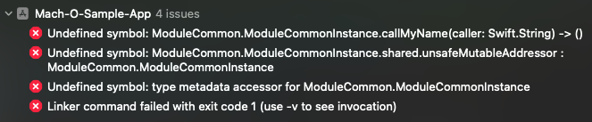
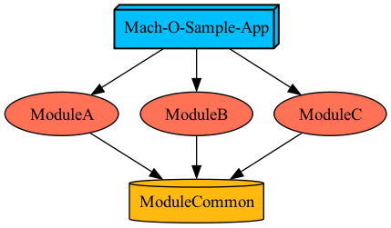
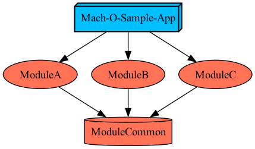
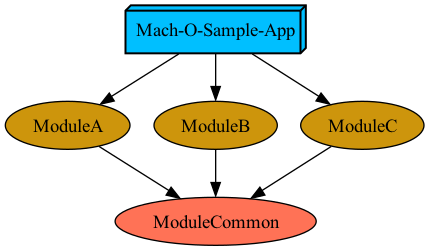
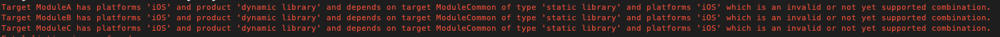
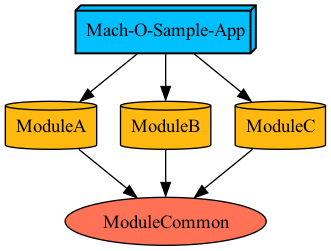

# Mach-O

> Mach Object file format

## Excutable

- 실행 파일

## Static Library

- 파일 형식:  `.a`
- **excutable file**에 포함된다.

## Dynamic Library

- 파일 형식: ``.dylib``
- Dynamic library에 대한 참조만 **excutable file**에 포함된다.

## 모듈 구성 실험

- 샘플 구성

  - Tuist를 사용하여 구성
  - `ModuleA`, `ModuleB`, `ModuleC`, `ModuleCommon`
  - 각각의 모듈에는 `{ModuleName}Instance.swift` 파일이 존재한다.
  - 모든 모듈의(앱 타겟 포함) Build Setting
    - Other Linker Flags: -ObjC
    - -all_Load는 심볼의 중복을 만들 수 있음
      - 신경쓰면 중복 안하게 할수도 있음
  - Build Phases
    - Embed Frameworks에 모듈을 포함하는것은 최종 앱 타겟이다.
    - Link Binary With Libraries에 모듈을 포함하는것은 최종 앱 타겟이다.
    - 기본 Tuist generate 사용
    - 각 모듈마다 추가 하게되면 .a 파일의 심볼이 달라지지만 결과적으로 **excutable file**에는 동일한 심볼(거의) 구성을 이룸
  
- 확인 방법

  - 빌드된 앱의 파일 구성 확인

  - 빌드된 앱 **excutable file**의 파일 용량 확인

  - 빌드된 앱 **excutable file**의 심볼 정보를 출력

    - ``` sh
      $ nm Mach_O_Sample_App.app/Mach_O_Sample_App| grep "\.o"
      ```

- 타겟별 graph 이미지


### Case 1.



| 결과                                            | 설명                                                         |
| ----------------------------------------------- | :----------------------------------------------------------- |
|        | 빌드된 앱 **excutable file**에 **object file** 심볼이 포함되어있다. |
|  | 최종 앱 **excutable file**의 용량은 250,064바이트(약250KB)   |


### Case 2.



Case1과 달리 `ModuleA`가 `ModuleB`, `ModuleC`에 종속성을 갖기 때문에 ModuleA의 사이즈가 커지며 중복이 발생하고 사이즈가 커질줄 알았다.

`ModuleA`에 **Link Binary With Libraries**에 `ModuleB`, `ModuleC`를 추가하면 libModuleA.a에 해당 라이브러리의 심볼이 포함 되지만 최종 **excutable file**에서는 포함되지 않는다.

하지만 Case1과 심볼 구성과 **excutable file**의 용량이 정확하게 같았다.

- 종속성을 갖는 모듈에 코드가 포함된다.❌ 
- **excutable file**에 포함된다. ✅

| 결과                                            | 설명                                                         |
| ----------------------------------------------- | :----------------------------------------------------------- |
|        | 빌드된 앱 **excutable file**에 **object file** 심볼이 포함되어있다. |
|  | 최종 앱 **excutable file**의 용량은 250,064바이트(약250KB)   |


### Case 3.



`ModuleCommon`을 Dynamic Library로 세팅 해보았다.

tuist generate 실패

`tuist generate` 실패



그래서 강제로 Xcode Build Settings에서 Mach-O Type을 바꿔서 빌드 해봤지만 심볼을 찾을 수 없다며 실패




### Case 4.



`ModuleCommon`을 Dynamic Framework로 세팅 해보았다.

- 앱 패키지 구성에 `ModuleCommon.framework`가 생긴다.
- Dynamic Framework는 따로 **excutable file**이 생성됨

| 결과                                                         | 설명                                                         |
| ------------------------------------------------------------ | ------------------------------------------------------------ |
|                | App 패키지 구성                                              |
|                | 앱의 **excutable file** 에 `ModuleCommen`의 심볼은 포함되지 않는다. |
|          | `CommonModule`의 **excutable file**에 내부 목적 코드 심볼이 포함된다. |
|          | `CommonModule`이 빠지면서 앱의 **excutable file** 용량이 줄어들었다.(255KB -> 248KB) |
|  | 하지만 앱 패키지의 용량은 140KB 정도 늘었다.                 |


### Case 5.



`ModuleCommon`을 Static Framework로 세팅 해보았다.

| 결과                                             | 설명                                                         |
| ------------------------------------------------ | ------------------------------------------------------------ |
|        | 빌드된 앱 **excutable file**에 **object file** 심볼이 포함되어있다. |
|  | 최종 앱 **excutable file**의 용량은 250,080바이트(약250KB)로 **Static Library**를 사용했을때 보다 살짝 늘었다. |


### Case 6.



`ModuleA`, `ModuleB`, `ModuleC`를 **Dynamic Library**로 구성하고 `ModuleCommon`을 **Dynamic Library**로 구성했다.

tuist generate 실패



**Static Library**와 **Dynamic Library**는 공존할 수 없나보다... 여기서의 **Dynamic Library**는 Framework가 아님 **Dynamic Framework**는 가능. 

그만 알아보도록 하자....


### Case7.



`ModuleA`, `ModuleB`, `ModuleC`는 **Dynamic Framework**로 구성하고 `ModuleCommon`은 **Static Library**로 구성했다.

- tuist generate는 가능
- 

| 결과 | 설명 |
| ---- | ---- |
|      |      |


